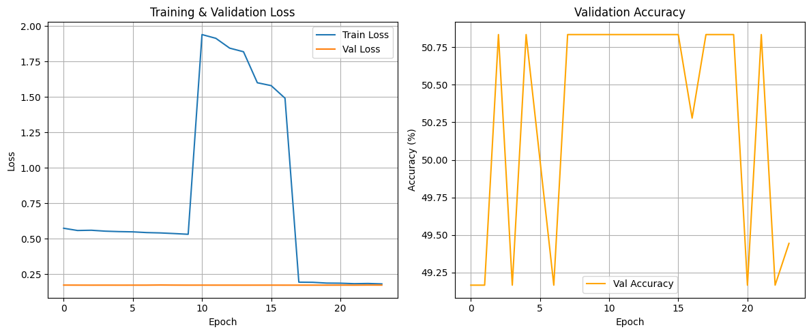
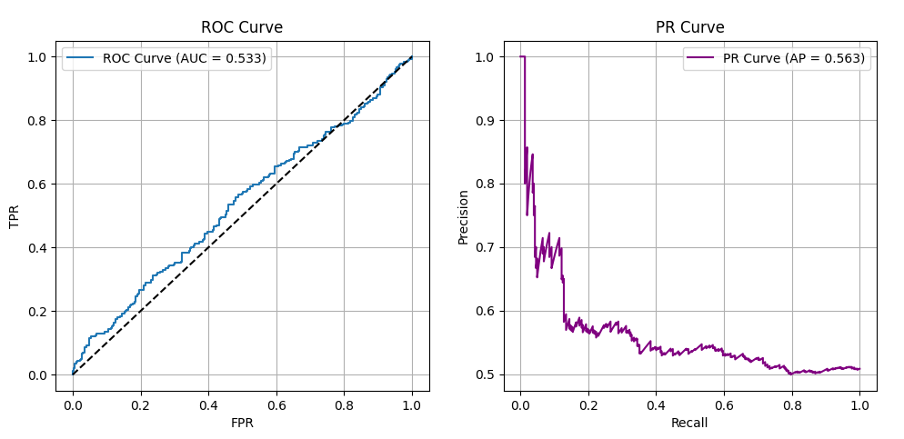

# Hierarchical Multimodal Fusion with Phased Training for Automated Pain Recognition

[](https://acii-conf.net/)
[](https://python.org)
[](https://pytorch.org)
[](LICENSE)

> Official implementation of our paper accepted at the **13th International Conference on Affective Computing and Intelligent Interaction Workshops and Demos (ACIIW 2025)**.

---

## Overview

This repository contains the full code and results for our multimodal pain recognition system developed for the **X-ITE Pain Challenge 2025**. The system performs binary classification of pain levels (low vs. high) by integrating four physiological signals, four video streams, and audio recordings through a novel hierarchical fusion architecture.

### Architecture

<p align="center">
  
  <br>
  <em>Fig. 1 — Overview of the Hierarchical Multimodal Fusion Architecture. Each modality is processed by a specialised feature extractor. The resulting 256-d features feed three parallel prediction streams (unimodal, pairwise, full cross-modal attention), whose seven logits are combined via a learnable ensemble.</em>
</p>

---

## Key Contributions

- **Memory-efficient unimodal encoders**: a 1D CNN-BiLSTM for physiological signals, a 2D CNN for log-Mel spectrograms, and a MobileNetV3-based video processor with gradient checkpointing and chunked frame processing.
- **Hierarchical fusion strategy**: unimodal → pairwise → cross-modal attention → learnable weighted ensemble (7 logits total).
- **Three-phase training curriculum**: stabilises unimodal representations before learning complex cross-modal interactions.
- **Composite loss function**: Focal Loss + Hierarchical Contrastive Loss + Uncertainty regularisation.
- **Uncertainty estimation head**: provides a calibrated confidence signal for downstream clinical decision support.

---

## Results

### Test Set Performance

| Class      | Precision | Recall | F1-Score | Support |
|------------|----------:|-------:|---------:|--------:|
| Low Pain   | 49.0%     | 100.0% | 66.0%    | 295     |
| High Pain  | 100.0%    | 1.0%   | 2.0%     | 305     |
| **Overall Accuracy** | | | **49.7%** | 600 |
| Macro Avg  | 75.0%     | 50.0%  | 34.0%    | 600     |
| Weighted Avg | 75.0%   | 50.0%  | 34.0%    | 600     |

The model learns a conservative, high-specificity decision boundary: it achieves **100% precision for High Pain** (zero false alarms) and **100% recall for Low Pain** (no low-pain case missed) — behaviours that are clinically desirable when false alarms are costly.

### Training Curves & Evaluation Metrics

<p align="center">
  
  <br>
  <em>Fig. 2 — Training and validation loss (left) and validation accuracy (right) across all three training phases. The model converges steadily, reaching a peak validation accuracy of 50.83%.</em>
</p>

<p align="center">
  
  <br>
  <em>Fig. 3 — ROC Curve (AUC = 0.533, left) and Precision-Recall Curve (AP = 0.563, right) on the held-out test set.</em>
</p>

---

## Ablation Studies

Comprehensive ablations (Table II of the paper) validate each design choice.

| Experiment | Accuracy (%) | F1 Weighted (%) | Prec. (High) (%) | Recall (High) (%) | F1 (High) (%) |
|---|---:|---:|---:|---:|---:|
| **Full Model (Benchmark)** | **49.70** | **34.00** | **100.00** | **1.00** | **2.00** |
| Simple Concat Fusion | 50.83 | 36.25 | 69.23 | 3.00 | 5.75 |
| End-to-End Training | 50.00 | 33.33 | 50.00 | 100.00 | 66.67 |
| No Contrastive Loss | 50.00 | 33.33 | 50.00 | 100.00 | 66.67 |
| Cross-Entropy Loss Only | 50.00 | 33.33 | 0.00 | 0.00 | 0.00 |
| Physio + Video | 50.00 | 33.33 | 50.00 | 100.00 | 66.67 |
| **Physio + Audio** | **51.83** | **45.18** | **51.08** | **86.67** | **64.28** |
| Video + Audio | 50.00 | 33.33 | 0.00 | 0.00 | 0.00 |
| Physio Only | 50.00 | 33.33 | 50.00 | 100.00 | 66.67 |
| Video Only | 50.00 | 33.33 | 0.00 | 0.00 | 0.00 |
| Audio Only | 50.00 | 33.33 | 0.00 | 0.00 | 0.00 |

**Key findings:**
- **Physio + Audio** is the strongest bimodal combination (51.83% acc, 45.18% weighted F1), suggesting a powerful synergy between physiological signals and vocal expression.
- **Cross-Entropy Only** causes the model to completely fail on High Pain (0% recall), confirming that Focal Loss is essential for handling class imbalance.
- Video streams do not contribute positively in the current architecture — an important target for future work.

---

## Repository Structure

```
xite-pain-recognition/
│
├── main.py                    # Entry point (train / evaluate / predict)
├── requirements.txt
├── configs/
│   └── default.yaml           # All hyperparameters
│
├── src/
│   ├── dataset.py             # Dataset class & augmentation pipelines
│   ├── model.py               # Full hierarchical architecture
│   ├── losses.py              # FocalLoss & HierarchicalContrastiveLoss
│   ├── trainer.py             # Three-phase training curriculum
│   ├── evaluate.py            # Metrics, plots, checkpoint loading
│   ├── inference.py           # Challenge submission file generator
│   └── utils.py               # Seeding, DataLoader factory, helpers
│
├── scripts/
│   └── run_ablation.py        # Reproduces Table II ablation study
│
├── assets/                    # Paper figures (architecture, curves, metrics)
└── results/                   # Generated checkpoints & plots (git-ignored)
```

---

## Installation

```bash
# 1. Clone the repository
git clone https://github.com/<your-username>/xite-pain-recognition.git
cd xite-pain-recognition

# 2. Create and activate a virtual environment
python -m venv venv
source venv/bin/activate        # Linux / macOS
# venv\Scripts\activate         # Windows

# 3. Install dependencies
pip install -r requirements.txt
```

> **GPU note**: A CUDA-capable GPU (≥ 16 GB VRAM recommended, tested on NVIDIA A100) is required for training. The model uses gradient checkpointing to reduce peak memory.

---

## Dataset

This project uses the **X-ITE Pain Challenge dataset** provided by the ACII 2025 organisers:

> Gruss S. et al., "Multi-modal signals for analyzing pain responses to thermal and electrical stimuli," *Journal of Visualized Experiments (JoVE)*, no. 146, e59057, 2019.

The dataset is **not distributed with this repository**. Please obtain access through the official challenge portal. Once downloaded, set `data_path` in `configs/default.yaml` to point to the dataset root.

**Expected directory layout:**
```
<data_path>/
  low_pain/
    S<id>/
      ecg_*.csv   scl_*.csv   emg_face_*.csv   emg_trap_*.csv
      fvf/*.mp4   fvs/*.mp4   ft/*.mp4          bdy/*.mp4
      audio/*.wav
  high_pain/
    ...
```

---

## Usage

### Training

```bash
python main.py --mode train --config configs/default.yaml
```

This runs the full three-phase curriculum (15 + 15 + 20 epochs by default) with early stopping. The best checkpoint is saved to `results/hierarchical_pain_model_optimized.pth`.

### Evaluation

```bash
python main.py --mode evaluate \
    --config configs/default.yaml \
    --checkpoint results/hierarchical_pain_model_optimized.pth
```

### Generating the Challenge Submission File

```bash
python main.py --mode predict \
    --config configs/default.yaml \
    --checkpoint results/hierarchical_pain_model_optimized.pth \
    --data /path/to/challenge/test_data
```

This writes `MINDH_Lab_Results.xlsx` with one sheet per test subject.

### Ablation Study

```bash
python scripts/run_ablation.py --config configs/default.yaml
```

Results are saved to `results/ablation_results.csv`.

---

## Configuration

All hyperparameters live in `configs/default.yaml`. Key settings:

| Parameter | Default | Description |
|---|---|---|
| `data_path` | *(set by user)* | Root directory of the X-ITE dataset |
| `segment_length_sec` | `10.0` | Duration of each sample window |
| `batch_size` | `1` | Per-GPU batch size |
| `gradient_accumulation_steps` | `16` | Effective batch size = 16 |
| `learning_rate` | `5e-5` | Base LR (halved each phase) |
| `epochs_phase1/2/3` | `15 / 15 / 20` | Epochs per training phase |
| `patience` | `7` | Early-stopping patience |
| `use_focal_loss` | `true` | Use Focal Loss (vs. Cross-Entropy) |
| `contrastive_loss_weight` | `0.2` | λ for hierarchical contrastive loss |
| `uncertainty_loss_weight` | `0.1` | λ for uncertainty regularisation |

---

## Citation

If you use this code, please cite our paper:

```bibtex
@inproceedings{chary2025hierarchical,
  title     = {Hierarchical Multimodal Fusion with Phased Training for
               Automated Pain Recognition in the X-ITE Challenge},
  author    = {Chary, Podakanti Satyajith and
               Kumar, Pithani Teja Venkata Ramana and
               Ganapathy, Nagarajan},
  booktitle = {Proceedings of the 13th International Conference on
               Affective Computing and Intelligent Interaction Workshops
               and Demos (ACIIW)},
  year      = {2025},
  note      = {Supported by Ministry of Education, Government of India}
}
```

---

## References

[1] T.-Y. Lin et al., "Focal Loss for Dense Object Detection," ICCV 2017.  
[2] A. Howard et al., "Searching for MobileNetV3," ICCV 2019.  
[3] T. Chen et al., "Training Deep Nets with Sublinear Memory Cost," arXiv:1604.06174.  
[4] D. S. Park et al., "SpecAugment," Interspeech 2019.  
[5] I. Loshchilov & F. Hutter, "Decoupled Weight Decay Regularization," arXiv:1711.05101.  
[6] S. Gruss et al., "Multi-modal signals for analyzing pain responses," JoVE, 2019.

---

## Acknowledgements

This work was supported by the **Ministry of Education, Government of India**. The X-ITE dataset was provided by the ACII 2025 organisers. Ethics approval for the original data collection was granted by the ethics committee of Ulm University.

---

*Department of Biomedical Engineering & Department of Engineering Science, IIT Hyderabad*
